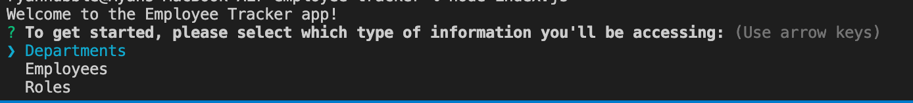
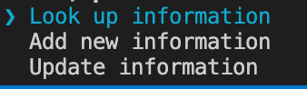
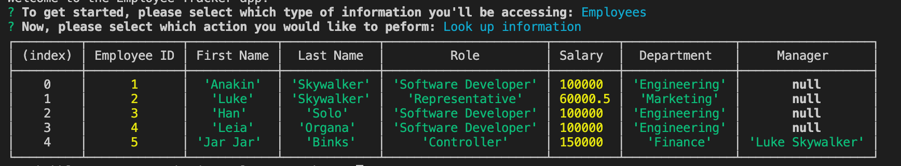
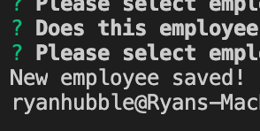

# Employee Tracker App    
  

  ## Table of Contents  
  1. [Description](#description) 
  2. [Installation](#installation) 
  3. [Usage](#usage)
  4. [Licensing](#licensing)
  5. [Contributing](#contributing) 
  6. [Additional Questions](#additional-questions?)

  ---  

  ## Description:  
  For this assignment, we were to create an application that allows a user to submit, update, and look up employee information stored on a database. Using the inquirer module, the user can respond to a series of prompts that lets them navigate the app and handle the data as needed.  

  ---  

  ## Installation:  
  To install, download the employee-tracker folder, install MySQL Server on your machine, and the app will be ready to use.  

  ---  

  ## Usage:  
  To get started, navigate to the employee-tracker directory in the terminal. Once there, enter 'node employee-tracker.js.' You will then be presented with a welcome message and the first question, which will ask you to select the type of data you want to access. 

  
  
  After that, the app will then ask you to select which action you'll be performing with the data. 
  
  
  
  If you choose to look up information, you'll be presented with a table of the relevant data. 
  
  
  
  If you choose to add or update information, you'll need to answer some additional questions in order to store the information you're providing. Once you've completed your task, you'll be presented with a message letting you know if your new information or update was saved.
  
  

  If you want to continue using the app, simply restart the app by typing 'node employee-tracker.js' after completing each task.   

  --- 

  ## Licensing:  
  Public Domain - App can be shared and modified however you want!

  ---  

  ## Contributing:  
  Feel free to download and make changes!  

  ---  
  ## Additional Questions?  
  If you have any other questions, you can contact the project creator at:  
  GitHub username: rhubble1987  
  Email address: rhubble1987@gmail.com
